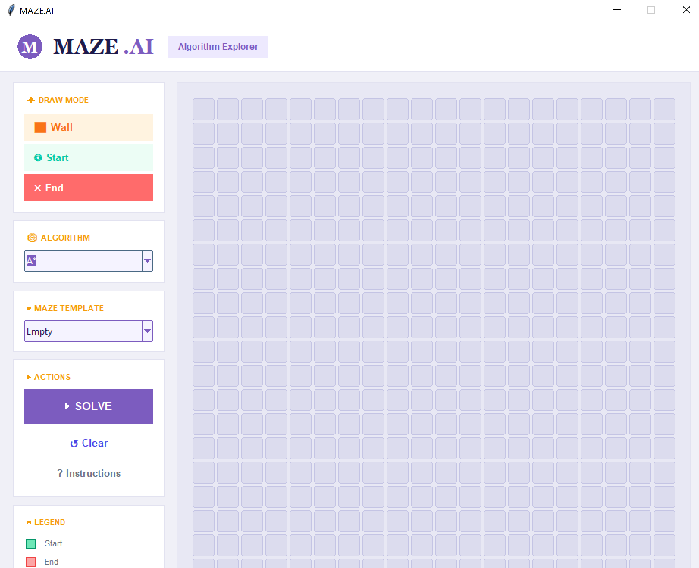
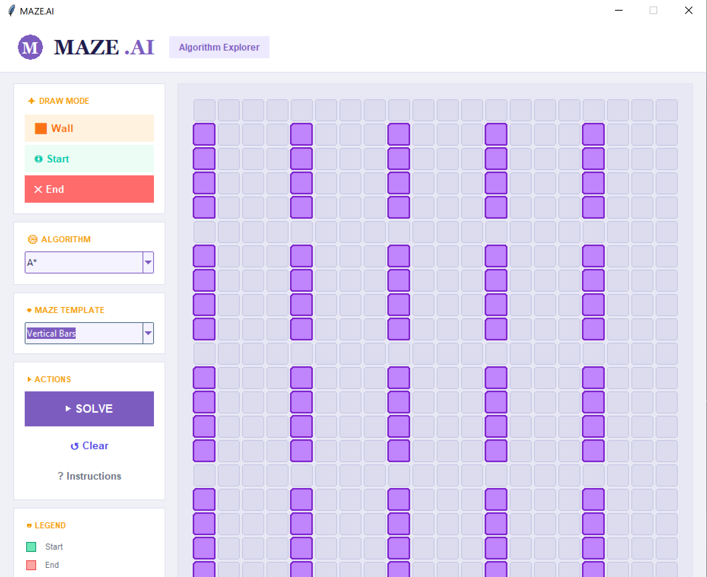
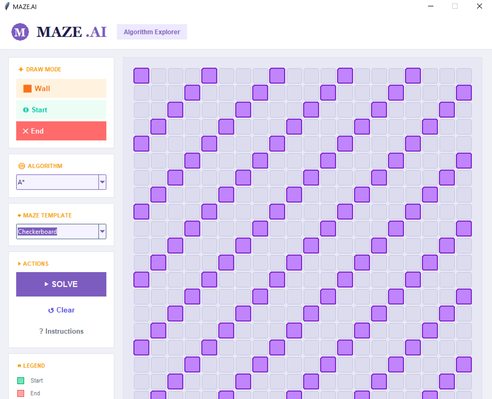
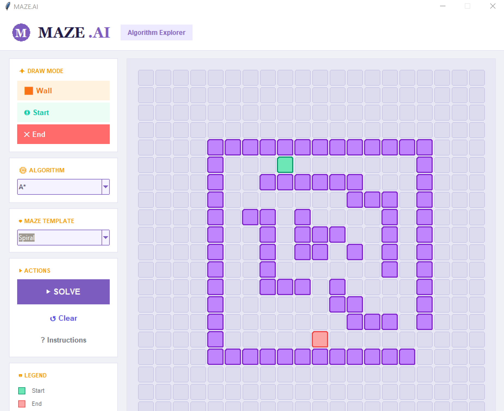
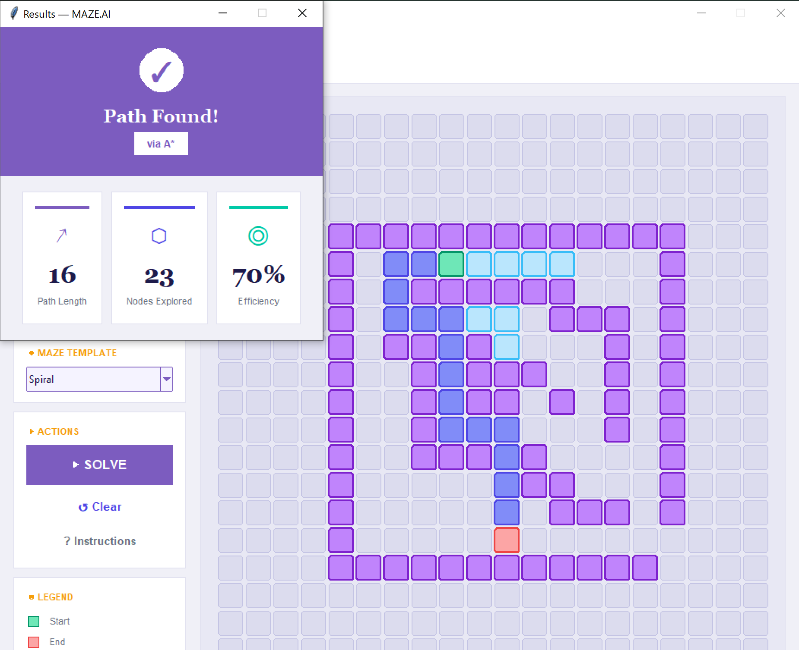
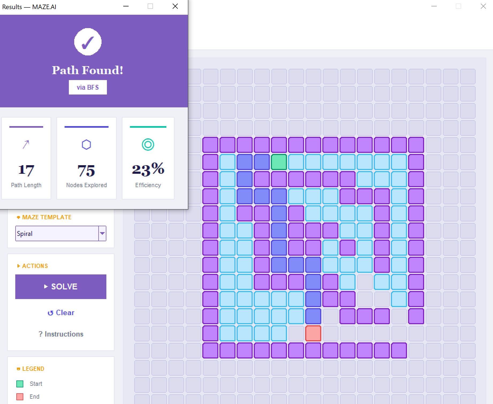
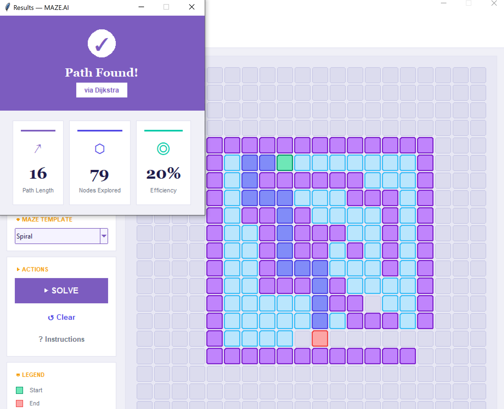

# AI Maze Solver



AI Maze Solver is an interactive desktop application built with Python and Tkinter that visualizes and compares classical pathfinding algorithms in real time. Users can design custom mazes, experiment with predefined maze templates, place start and goal nodes, and observe how different search algorithms explore the environment before determining the shortest path.

The project was developed to strengthen my understanding of artificial intelligence search techniques, graph traversal, heuristic search, and algorithm visualization through an interactive graphical interface.

<p align="center">


</p>

---

## Overview

The application provides a visual learning environment for exploring pathfinding algorithms. Instead of displaying only the final solution, each algorithm is animated step by step, allowing users to understand how nodes are explored, how decisions are made, and why different search strategies produce different exploration patterns.

Users can either create their own maze or select from several built-in templates to compare the performance of different search algorithms under various obstacle configurations.

---

## Features

### Interactive Maze Editor

- Create custom maze layouts
- Draw and erase walls
- Place start and goal nodes
- Reset the maze at any time

### Search Visualization

- Step-by-step algorithm animation
- Real-time node exploration
- Final path reconstruction
- Visual comparison of search behavior

### Predefined Maze Templates

- Empty Grid
- Checkerboard Pattern
- Spiral Maze
- Vertical Bars
- The Box

### Algorithm Comparison

Compare how different algorithms:

- Explore the search space
- Navigate around obstacles
- Find the shortest path
- Balance efficiency and optimality

---

## Implemented Algorithms

### A* Search

A* is an informed search algorithm that combines the actual path cost with the Manhattan Distance heuristic to efficiently locate the shortest path. It typically explores fewer nodes than uninformed search algorithms while still guaranteeing the optimal solution.

### Breadth-First Search (BFS)

Breadth-First Search explores nodes level by level and guarantees the shortest path when all movements have equal cost. It serves as an excellent baseline for comparing search behavior.

### Dijkstra's Algorithm

Dijkstra's Algorithm expands nodes according to the lowest accumulated path cost without using heuristics. Although it may explore more nodes than A*, it always guarantees the optimal path.

---

## Application Preview

### Main Interface

The application provides an intuitive interface where users can create custom mazes, select predefined templates, choose search algorithms, and visualize pathfinding in real time.


---

### Built-in Maze Templates

Several predefined maze layouts are available to evaluate algorithm performance under different obstacle configurations, including the Vertical Bars and Checkerboard templates.

**Vertical Bars Template**



**Checkerboard Template**



---

### Algorithm Test Environment

A configurable testing environment where users can place the start node, goal node, and obstacles before executing different search algorithms.



---

### A* Search Visualization

A* uses heuristic information to efficiently guide the search toward the destination, generally requiring fewer node expansions while maintaining optimality.



---

### Breadth-First Search Visualization

Breadth-First Search expands nodes uniformly across the search space until the destination is reached, guaranteeing the shortest path in an unweighted grid.



---

### Dijkstra's Algorithm Visualization

Dijkstra's Algorithm explores nodes based on the lowest accumulated path cost, demonstrating optimal pathfinding without relying on heuristic estimates.



---

### User Guide

A built-in guide explains how to create mazes, select algorithms, and interact with the application, making it easy for new users to begin experimenting with different search techniques.


---

## Technology Stack

### Programming Language

- Python

### GUI Framework

- Tkinter

### Libraries

- heapq
- collections (deque)

### Concepts

- Artificial Intelligence
- Search Algorithms
- Graph Traversal
- Heuristic Search
- Data Structures
- Algorithm Visualization

---

## Project Structure

```text
AI-Maze-Solver/
├── screenshots/
├── maze_solver.py
└── README.md
```

---

## Learning Outcomes

This project strengthened my understanding of:

- Artificial Intelligence search techniques
- Graph traversal algorithms
- Heuristic search
- Pathfinding algorithms
- GUI development using Tkinter
- Priority queues and queue-based data structures
- Algorithm visualization and performance comparison

---

## Future Improvements

- Greedy Best-First Search
- Depth-First Search (DFS)
- Bidirectional Search
- Weighted Maze Support
- Performance Metrics
- Search Tree Visualization
- Additional Heuristic Functions
- Save and Load Maze Configurations

---

## Author

**Fatima Niazi**
